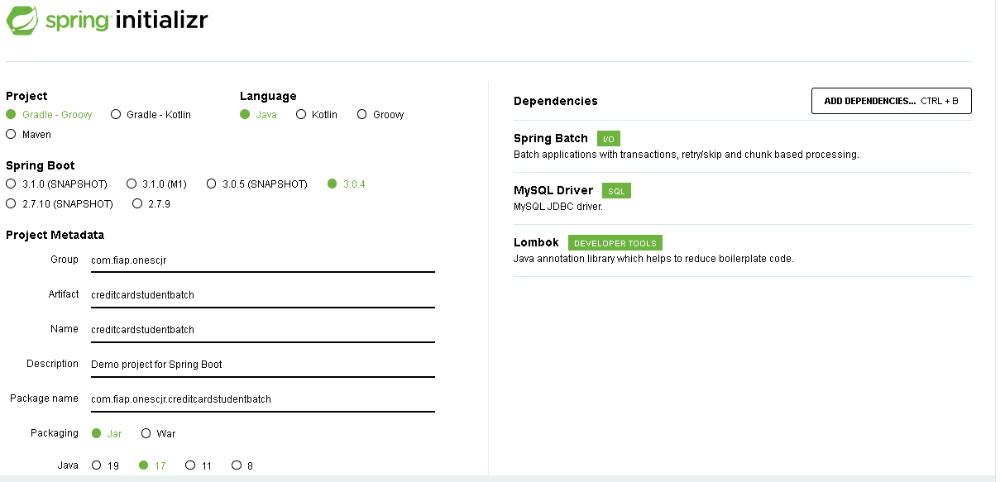
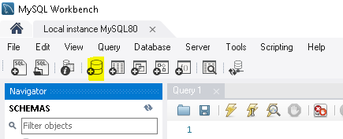
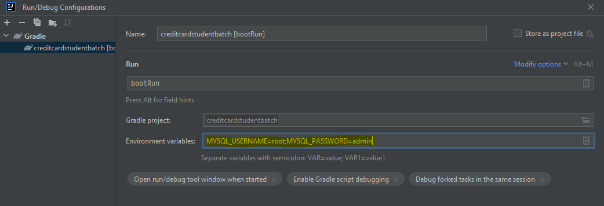

# CREDIT CARD STUDENT BATCH

---
<!-- 
# OVERVIEW

---
--> 
# GRUPO

- RM346315: Lais Kagawa ([lakagawa](https://github.com/lakagawa))
- RM346511: Jônatha Lacerda Gonzaga ([jhowlacerda](https://github.com/jhowlacerda))
- RM346958: Thiago de Souza Zanella ([zanella86](https://github.com/zanella86))

---

# REPOSITÓRIOS RELACIONADOS

https://github.com/zanella86/CreditCardStudentWeb

---

# FERRAMENTAS / TECNOLOGIAS

<!-- - [Draw.io](https://app.diagrams.net/) -->
- Git / Github
- Gradle 7.6
- IntelliJ IDEA Community Edition (2022.2.1)
- MySQL Workbench 8.0 CE
- Spring Boot 3.0.4 (Java 17+)
- Spring Batch

---

# CONSTRUÇÃO/JUSTIFICATIVA

<u>Utilizamos o Spring Framework:</u>

- **Spring Batch:** Para carga dos arquivos/integração

<u>Outros:</u>

- MySQL Driver: Para utilização do MySQL
- Lombok: Para redução da verbosidade

---

# PARA TESTAR

## Bancos de dados

### MySQL

- Crie um *database schema* no MySQL chamado `credit-card-student`

## Aplicação

### IDE

Adicione os parâmetros para conexão:

> MYSQL_USERNAME=meu_usuario;MYSQL_PASSWORD=minha-senha

---

# REFERÊNCIAS

- [Prof.º Fabio Tadashi - Travel](https://github.com/fabiotadashi/1SCJR-travel)
- [Spring Initializr](https://start.spring.io/;)
- [Baeldung - Spring Boot with Spring Batch](https://www.baeldung.com/spring-boot-spring-batch)
- [StackOverFlow - How to solve deprecation warning of JobBuilderFactory and StepBuilderFactory](https://stackoverflow.com/questions/75508267/how-to-solve-deprecation-warning-of-jobbuilderfactory-and-stepbuilderfactory)
  - [Spring Batch 5.0 Migration Guide](https://github.com/spring-projects/spring-batch/wiki/Spring-Batch-5.0-Migration-Guide)